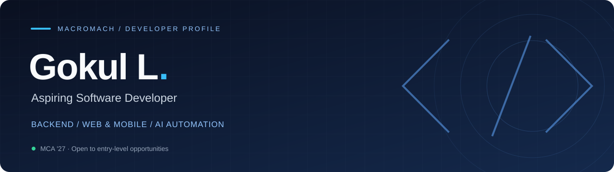

  

<h3 align="center">Turning ideas into APIs, applications, and automation.</h3>

MCA Student · Aspiring Software Developer · Class of 2027

  
  

---

## A little about me

I'm **Gokul**, an MCA student transitioning from corporate operations into software development. I enjoy working on the systems behind applications: APIs, databases, server-side workflows, and automation.

- **Building with:** Node.js, PostgreSQL, Redis, Laravel, and Flutter.
- **Exploring:** AI model integration, Python automation, and Unity technologies.
- **Bringing to development:** attention to detail, documentation, and practical problem-solving from my operations background.
- **Looking for:** entry-level Software Developer / Associate Software Engineer opportunities.

## My toolkit

**Languages**

**Backend & databases**

**Web, mobile & tools**

## Selected work

<table>
<tr>
<td width="50%" valign="top">

### 01 / Game Server Backend

Server-side services for a Unity-based game, covering API handling, database operations, and game-service workflows.

**My work:** backend logic, deployment, testing, and debugging on Linux.

`Node.js` `PostgreSQL` `Redis` `REST APIs` `Linux`

</td>
<td width="50%" valign="top">

### 02 / E-commerce Platform

A Laravel website and three Flutter applications for customers, vendors, and delivery personnel.

**My work:** web and mobile development with separate role-based application flows.

`Laravel` `Flutter` `Web & Mobile`

</td>
</tr>
</table>

## Beyond the code

My corporate operations experience spans **First American**, **Trigent Software**, and **Tata Consultancy Services**. Working with documentation, process accuracy, status tracking, and issue resolution has shaped how I approach technical work.

**Currently pursuing:** Master of Computer Applications · Expected 2027

---

  <b>Let's build something useful.</b> 
  Open to entry-level development opportunities.  
  <a href="https://www.linkedin.com/in/gokull2004">Get in touch on LinkedIn ↗</a>

